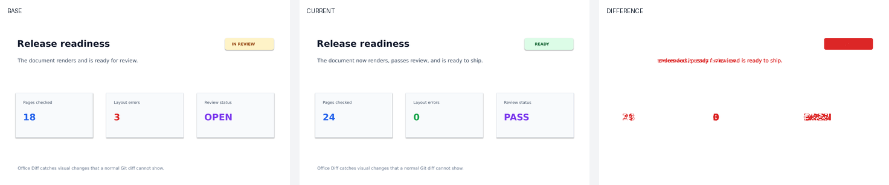

# Office Diff Action

**See what changed in Word and PowerPoint before you merge. / 在合并前看清 Word 和 PowerPoint 到底改了什么。**

English · [简体中文](README.zh-CN.md)

[](https://github.com/zhuyep/office-diff-action/actions/workflows/test.yml)
[](LICENSE)

GitHub can store `.docx` and `.pptx` files, but its normal diff cannot show a
reviewer that text reflowed, a slide moved, or a document stopped rendering.
Office Diff turns every changed page or slide into a base/current/difference
contact sheet and produces text and machine-readable diffs alongside it. The
new, unreleased **preflight** mode inspects extracted text, font declarations
and environment evidence before you install or run a renderer.

> 中文用户可以直接阅读[完整中文说明](README.zh-CN.md)，包含 GitHub Actions
> 接入示例、本地使用方式、安全边界和当前限制。



## Try the preflight demo

From this source checkout, with **Python 3.9 or newer**:

```bash
python examples/preflight_demo.py
```

No pip installation, Pillow, LibreOffice, Poppler, API key or server is needed.
Open either generated report in your browser:

- `examples/generated/preflight/text-change/index.html`: text changes while the
  observed environment stays the same.
- `examples/generated/preflight/environment-drift/index.html`: the same document
  is checked against two different font inventories.

You can also open the saved [text-change sample](assets/preflight-demo/text-change/index.html)
or [environment-drift sample](assets/preflight-demo/environment-drift/index.html)
after downloading this checkout. **Both demos use synthetic documents and
clearly labeled synthetic environments. They are not measurements of your
machine and do not render Office pages.**

## Preflight your own documents

The commands below describe the unreleased source implementation. They do not
change the published Action image or package version. In a locally installed
checkout, use:

```bash
office-diff doctor --output current-environment.json
office-diff preflight before.docx after.docx \
  --environment current-environment.json \
  --baseline-environment baseline-environment.json \
  --output preflight-report
```

`baseline-environment.json` should be a `doctor` snapshot saved in the environment
used for the baseline. Omit `--baseline-environment` when you do not have one;
the report will say that environment drift was not compared. The same commands
accept two `.pptx` files.

To run directly from the repository root without installing any dependencies:

```bash
PYTHONPATH=src python -m officediff doctor --output current-environment.json
PYTHONPATH=src python -m officediff preflight before.docx after.docx --output preflight-report
```

For PowerShell, set `$env:PYTHONPATH = "src"` first, then use
`python -m officediff` with the same arguments. Python must be version 3.9 or newer.

| Option | Behavior |
|---|---|
| `doctor` | Prints a JSON environment snapshot to stdout. |
| `doctor --output NEW.json` | Writes a new file; refuses to overwrite an existing file. |
| `preflight --environment CURRENT.json` | Uses the supplied current snapshot; otherwise captures the local environment. |
| `preflight --baseline-environment BASE.json` | Compares the observed baseline and current environments; also checks the baseline document against that snapshot. |
| `preflight --output DIRECTORY` | Writes `index.html`, `summary.json` and `environment.json`; defaults to `office-preflight-report`. |
| `preflight --fail-on-warning` | Returns exit code 1 if any warning is present, after writing the report. |

Preflight returns 0 after a successful report by default, even when evidence is
incomplete or warnings are present. Invalid input or an output error returns 2.
Without a baseline snapshot, both document versions are checked against the
current environment. Missing renderer tools are recorded; they do not prevent
`doctor` or `preflight` from running.

### How to read the evidence

- **Font declarations are not actual font usage.** A declaration may be in an
  unused style. Theme references remain unresolved; theme palettes and font-table
  catalogs are not treated as missing fonts.
- **Unavailable font evidence means unknown.** If the font inventory is absent
  or partial, availability is reported as unknown. A declared family absent from
  a complete inventory is a substitution risk, not proof of substitution. An
  available family does not prove glyph coverage or the renderer's selection.
- **The fingerprint covers observations, not deterministic rendering.** It
  records platform fields, discovered tool versions, font families and observed
  font-file hashes. It does not fully capture fontconfig rules, Office settings,
  locale or other dependencies. Matching fingerprints cannot guarantee matching
  pages; differing fingerprints cannot prove the cause of a visual change.
- **No pages are rendered by preflight.** Unchanged extracted text does not mean
  equivalent documents: formatting, images, charts and some fields are outside
  the check. Text reaching the extraction limit is marked incomplete and emits a
  warning. PPTX text currently follows part filenames, not presentation order.

The motivation is practical: [pdf-diff issue #56](https://github.com/JoshData/pdf-diff/issues/56)
reports false-positive change markings caused by its algorithm, while
[Docxodus issue #379](https://github.com/JSv4/Docxodus/issues/379) documents the
need to distinguish font-environment changes from renderer regressions. The
latter is closed and resolved; it is evidence of the need for diagnostics,
not an unfilled feature claim. Neither report establishes a font bug in Office Diff.

## What it produces

- a static HTML report you can open without a server;
- before/current/difference images for every page or slide;
- a unified diff of text extracted directly from Office Open XML;
- a JSON summary for later policy checks;
- an environment snapshot in `environment.json` and `summary.json`, with its
  observed fingerprint and limitations in the HTML and Markdown visual reports;
- a compact GitHub Actions job summary.

It supports `.docx` and `.pptx`. The project reviews documents; it does not edit
or generate them.

## Use it in a pull request

```yaml
name: Review Office changes

on:
  pull_request:
    paths:
      - "**/*.docx"
      - "**/*.pptx"

permissions:
  contents: read

jobs:
  office-diff:
    runs-on: ubuntu-latest
    steps:
      - uses: actions/checkout@v4
        with:
          fetch-depth: 0

      - name: Render Office diff
        id: office-diff
        uses: zhuyep/office-diff-action@v1
        with:
          base-ref: ${{ github.event.pull_request.base.sha }}
          head-ref: ${{ github.event.pull_request.head.sha }}

      - name: Upload visual report
        uses: actions/upload-artifact@v4
        with:
          name: office-diff-report
          path: office-diff-report
```

Open the `office-diff-report` artifact from the workflow run and then open
`index.html`.

## Render a visual diff locally

LibreOffice and Poppler must be available on `PATH`.

```bash
python -m pip install .
office-diff compare before.pptx after.pptx --output office-diff-report
```

The command exits non-zero when rendering fails. Text extraction still runs, so
the report records partial evidence instead of hiding the failure.
`compare` and `action` keep their existing options and exit behavior. Their new
environment snapshot is diagnostic evidence; font risks do not change the
Action's success or failure status. Full local Office rendering has not been
validated as part of this preflight MVP.

## Report structure

```text
office-diff-report/
├── index.html          # visual review
├── report.md           # portable Markdown report
├── summary.json        # automation-friendly result
├── environment.json    # observed rendering environment
└── documents/
    └── .../
        ├── base/       # rendered baseline pages
        ├── current/    # rendered proposed pages
        └── diff/       # three-panel review images
```

## Design choices

- **Rendering is evidence, not ground truth.** Both sides of a comparison use
  the same released container environment. The Dockerfile does not lock the apt
  package versions for LibreOffice, Poppler or fonts, so separate rebuilds can
  differ. A future container release can also change rendering, and Microsoft
  Office can paginate a complex document differently.
- **No document leaves the runner.** The Action does not upload inputs to a
  third-party service. Uploading the generated artifact is an explicit workflow
  step controlled by the repository.
- **Changes do not fail by default.** An Office file is expected to change in a
  pull request. Rendering failures fail the Action; change-policy gates can read
  `summary.json`.
- **Review comes before scoring.** The first job is to show reviewers reliable
  evidence, not invent an opaque AI quality score.

## Inputs

| Input | Default | Purpose |
|---|---|---|
| `base-ref` | required | Baseline commit/ref |
| `head-ref` | `HEAD` | Proposed commit/ref |
| `output-dir` | `office-diff-report` | Report directory |
| `dpi` | `110` | Render resolution |
| `pixel-threshold` | `16` | Ignore small per-pixel differences |
| `allow-render-errors` | `false` | Keep the workflow green after render errors |

## Current limits

- The visual report is a workflow artifact, not an inline PR image gallery.
- Password-protected and legacy `.doc`/`.ppt` files are not supported.
- Git LFS-backed Office files currently stop with an explicit unsupported error.
- Fonts unavailable in the container are substituted.
- Pages/slides are matched by position; move detection is not yet semantic.
- LibreOffice rendering is close to, but not identical to, desktop Microsoft Office.
- One run accepts at most 20 changed documents and 200 pages/slides per document;
  render DPI is constrained to 36–300 to keep untrusted pull requests bounded.

These limits are deliberate and visible. Please open an issue with a small,
shareable sample document when you encounter a rendering problem.

## Roadmap

- optional PR comment linking to the workflow report;
- configurable checks for page-count and slide-count changes;
- effective font selection and substitution evidence beyond declaration preflight;
- semantic slide matching for moved slides;
- XLSX support only if real users request it.

## Contributing

Small reproduction files and focused rendering cases are especially valuable.
See [CONTRIBUTING.md](CONTRIBUTING.md). By participating, you agree to follow
the [Code of Conduct](CODE_OF_CONDUCT.md). 中文贡献说明见
[CONTRIBUTING.zh-CN.md](CONTRIBUTING.zh-CN.md)。

## License

[MIT](LICENSE)
